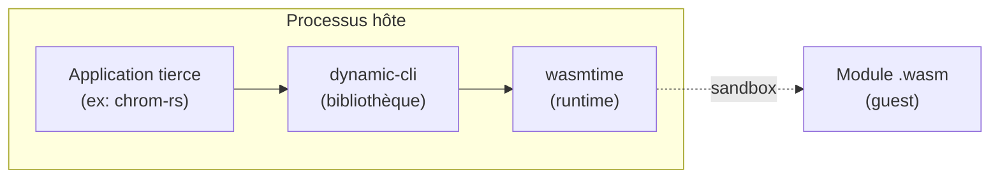
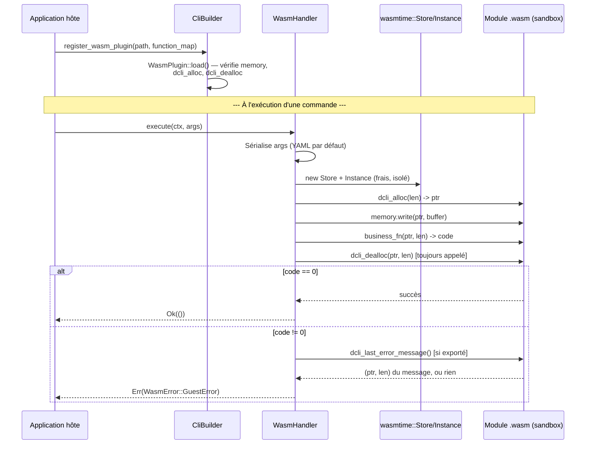

# Guide de conception de plugins — `dynamic-cli`

>Prise en main de la réalisation et de l'enregistrement de plugins pour une application tierce utilisant le crate `dynamic-cli`.

* Contexte de décision :
  * Décision de conception (architecture du système de plugins) [DD-021](https://github.com/biface/dcli/issues/10)
  * implémentation des plugins statiques : [trait `Plugin`](https://github.com/biface/dcli/issues/22)
  * implémentation des plugins encapsulés en environnement WASM : [`WasmPlugin`](https://github.com/biface/dcli/issues/23)
* **Dernière mise à jour** : 2026-06-17 (v0.4.0)

---

## Vue d'ensemble

`dynamic-cli` propose deux façons d'étendre une application avec des handlers qui ne vivent pas dans le crate de l'application hôte elle-même :

| Mécanisme                              | Quand l'utiliser                                                                                    | Coût                                                                                                   |
|----------------------------------------|-----------------------------------------------------------------------------------------------------|--------------------------------------------------------------------------------------------------------|
| **Plugins statiques** (trait `Plugin`) | Le code du plugin est compilé dans le binaire hôte                                                  | Aucun `unsafe`, aucune dépendance supplémentaire, aucun surcoût à l'exécution                          |
| **Plugins WASM** (`WasmPlugin`)        | Le plugin doit être distribué et chargé indépendamment du binaire hôte, ou exécuté dans une sandbox | Dépendance `wasmtime` (opt-in via `features = ["wasm-plugins"]`), contrat ABI côté guest à implémenter |

Une troisième option a été envisagée puis **exclue définitivement** : le chargement dynamique de bibliothèques natives via `libloading`. L'ABI de Rust n'est pas stable entre les versions du compilateur, ce qui rend cette approche structurellement non sûre, quelle que soit la qualité de l'implémentation.

Les deux mécanismes supportés partagent un même principe architectural, hérité de la conception "config-first" du framework : **la configuration YAML reste l'unique source de vérité pour les définitions de commandes.**

En d'autres termes, un plugin — statique ou WASM — ne déclare jamais ses propres commandes. Il ne fournit que le *handler* d'une commande que l'application hôte a déjà déclarée dans sa configuration YAML.

---

## Le contrat YAML commun

Qu'un handler provienne d'un plugin statique, d'un plugin WASM, ou d'un appel direct à `CliBuilder::register_handler()`, chacun respecte le même formalisme d'enregistrement dans le fichier de configuration YAML.

Une entrée de commande nomme une `implementation`, et *quelque chose* doit fournir un handler sous ce nom exact au moment où `CliBuilder::build()` s'exécute. Pour plus d'éléments sur la configuration YAML, voir [La syntaxe de configuration](CONFIG_SYNTAX_REFERENCE.fr.md).

```yaml
commands:
  - name: greet
    description: "Greet someone"
    implementation: greet_hello   # <- c'est cette clé qu'un plugin doit faire correspondre
    arguments: []
    options: []
```

La méthode de construction `build()` ne se préoccupe pas de l'origine de `greet_hello`. Qu'il vienne de `Plugin::handlers()` d'un plugin statique, de la fonction métier mappée d'un plugin WASM, ou d'un `Box<dyn CommandHandler>` enregistré directement, tous sont fusionnés dans la même table de résolution interne avant que les commandes ne soient résolues.

Cela permet en outre de combiner plusieurs mécanismes dans une même application : un `SystemPlugin` pour `help`/`version`/`exit`, un plugin WASM pour une commande tierce sandboxée, et un handler natif écrit à la main pour la logique métier centrale de l'application peuvent tous coexister — à condition qu'aucun de ces mécanismes ne revendique le même nom `implementation`.

Si deux sources tentent de fournir le même nom `implementation`, `build()` échoue avec une erreur de conflit explicite plutôt que de laisser l'une écraser silencieusement l'autre. Voir [Détection de conflit](#détection-de-conflit) ci-dessous.

---

## Plugins statiques

### Le trait `Plugin`

```rust
pub trait Plugin: Send + Sync {
    fn name(&self) -> &str;
    fn version(&self) -> &str;
    fn description(&self) -> &str;
    fn handlers(&self) -> Vec<(String, Box<dyn CommandHandler>)>;
}
```

Un plugin déclare des métadonnées — `name`, `version`, `description`, utilisées pour l'introspection, par exemple lister les plugins chargés — et les handlers qu'il fournit, chacun étiqueté avec le nom `implementation` auquel il doit correspondre.

Le trait est délibérément *déclaratif* : un plugin retourne ses handlers, il ne reçoit pas un `&mut CommandRegistry` pour les enregistrer lui-même.

Cela maintient le contrôle de l'enregistrement du côté du framework, pas du plugin. C'est exactement le même schéma que suit `CommandHandler` lui-même : un handler déclare sa logique d'exécution, le framework décide quand l'invoquer.

Cela permet également au framework de valider chaque nom de handler avant qu'aucun d'eux ne touche le registre — ce qui rend possible une détection de conflit propre (voir ci-dessous) plutôt que de laisser un plugin écraser silencieusement une commande existante.

### Enregistrer un plugin statique

```rust
use dynamic_cli::CliBuilder;
use dynamic_cli::plugin::SystemPlugin;

let app = CliBuilder::new()
    .config_file("commands.yaml")
    .context(Box::new(MyContext::default()))
    .register_plugin(Box::new(SystemPlugin::new()))
    .build()?;
```

`register_plugin()` peut être appelé plusieurs fois, et librement combiné avec `register_handler()` pour les handlers qui ne proviennent pas d'un plugin.

### `SystemPlugin` — l'implémentation de référence

`dynamic-cli` fournit un plugin statique prêt à l'emploi : [`SystemPlugin`](../src/plugin/system.rs), qui fournit les trois commandes dont presque toute application a besoin :

| Nom `implementation` | Comportement                                                        |
|----------------------|---------------------------------------------------------------------|
| `system_help`        | Affiche l'aide globale ou par commande via le `HelpFormatter` actif |
| `system_version`     | Affiche la version depuis `metadata.version` de la config           |
| `system_exit`        | Exécute un callback d'arrêt, puis quitte                            |


```yaml
commands:
  - name: help
    implementation: system_help
    aliases: ["h", "?"]
    description: "Show help"
    arguments: []
    options: []

  - name: version
    implementation: system_version
    description: "Show version"
    arguments: []
    options: []

  - name: exit
    implementation: system_exit
    aliases: ["quit", "q"]
    description: "Exit the application"
    arguments: []
    options: []
```

```rust
CliBuilder::new()
    .config_file("commands.yaml")
    .context(Box::new(MyContext::default()))
    .register_plugin(Box::new(SystemPlugin::new()))
    .build()?
    .run()
```

#### Callback d'arrêt (shutdown)

Le comportement par défaut de `system_exit` est `std::process::exit(0)`. Une application qui a besoin d'une séquence d'arrêt propre — vider des logs, fermer des connexions, sauvegarder un état — peut fournir son propre callback :

```rust
SystemPlugin::new()
    .with_exit_fn(|| {
        eprintln!("Saving session…");
        // fermer les ressources ici
        std::process::exit(0);
    })
```

Le callback s'exécute avant la terminaison du processus ; c'est à l'application qu'il revient de réellement quitter à la fin de celui-ci.

### Écrire son propre plugin statique

Un plugin statique est n'importe quel type qui implémente `Plugin`. Aucun échafaudage ni macro n'est requis — voir le rustdoc de `src/plugin/mod.rs` pour un exemple minimal complet, et `src/plugin/system.rs` pour un plugin avec plusieurs handlers et une configuration fournie au constructeur (`with_config`, `with_exit_fn`).

#### Exemple concret — un plugin de diagnostic pour `chrom-rs`

`chrom-rs` est une application de simulation de chromatographie en phase liquide. Ses scénarios sont pilotés par trois fichiers YAML indépendants (`model.yml`, `scenario.yml`, `solver.yml`) consommés par la commande `chrom-rs run`.

Avant de lancer une simulation potentiellement longue — RK4 sur plusieurs milliers de points temporels — il est utile de pouvoir valider la cohérence des trois fichiers sans exécuter le solveur.

L'exemple ci-dessous reprend la structure réelle de `chrom-rs` : son `ExecutionContext` (`ChromContext`, qui porte un `project_dir` validé), le pattern de downcast utilisé par `RunHandler`, et le schéma d'options tel que défini dans `commands.yml`.

Le plugin vit dans son propre fichier, à côté de `app.rs`, comme un nouveau sous-module de `src/cli/` :

```
src/cli/
    mod.rs           — build_app(), orchestration (existant)
    app.rs           — ChromContext, RunHandler (existant)
    diagnostics.rs   — DiagnosticsPlugin, ValidateConfigHandler (nouveau)
```

`src/cli/diagnostics.rs` :

```rust
use dynamic_cli::plugin::Plugin;
use dynamic_cli::executor::CommandHandler;
use dynamic_cli::context::ExecutionContext;
use dynamic_cli::error::ExecutionError;
use dynamic_cli::DynamicCliError;
use std::collections::HashMap;

use crate::cli::app::ChromContext;

/// Plugin de diagnostic pour chrom-rs : vérifie la présence des fichiers
/// de configuration avant une exécution coûteuse.
struct DiagnosticsPlugin;

impl Plugin for DiagnosticsPlugin {
    fn name(&self) -> &str { "chrom-diagnostics" }
    fn version(&self) -> &str { "1.0.0" }
    fn description(&self) -> &str {
        "Validation des fichiers model/scenario/solver avant simulation"
    }

    fn handlers(&self) -> Vec<(String, Box<dyn CommandHandler>)> {
        vec![
            ("validate_config".to_string(), Box::new(ValidateConfigHandler)),
        ]
    }
}

struct ValidateConfigHandler;

impl CommandHandler for ValidateConfigHandler {
    fn execute(
        &self,
        ctx: &mut dyn ExecutionContext,
        args: &HashMap<String, String>,
    ) -> dynamic_cli::Result<()> {
        // Même pattern de downcast que RunHandler (src/cli/app.rs) : le
        // plugin a besoin du project_dir déjà validé par ChromContext,
        // pas d'un chemin brut.
        let chrom_ctx = ctx
            .as_any_mut()
            .downcast_mut::<ChromContext>()
            .ok_or_else(|| {
                DynamicCliError::from(ExecutionError::ContextDowncastFailed {
                    expected_type: "ChromContext".to_string(),
                    suggestion: None,
                })
            })?;

        let project_dir = chrom_ctx.project_dir();

        // Les valeurs par défaut ("model.yml", "scenario.yml", "solver.yml")
        // sont désormais portées par `default:` dans commands.yml et déjà
        // appliquées par le parser avant que ce handler ne s'exécute
        // (`CliParser::apply_defaults`) — args.get() ne devrait donc jamais
        // renvoyer None ici tant que le YAML reste cohérent avec la commande
        // déclarée. Le filet de sécurité ci-dessous reste défensif, pas
        // nécessaire en usage normal.
        let model = args.get("model").map(String::as_str).unwrap_or("model.yml");
        let scenario = args.get("scenario").map(String::as_str).unwrap_or("scenario.yml");
        let solver = args.get("solver").map(String::as_str).unwrap_or("solver.yml");

        for (label, file) in [("model", model), ("scenario", scenario), ("solver", solver)] {
            let path = project_dir.join(file);
            if !path.is_file() {
                println!("✗ {label} : fichier introuvable ({})", path.display());
            } else {
                println!("✓ {label} : {}", path.display());
            }
        }

        // Une vraie implémentation pousserait la validation plus loin :
        // cohérence des espèces chimiques entre model.yml et scenario.yml,
        // bornes du domaine compatibles avec la configuration du solveur.
        Ok(())
    }
}
```

Voici le fichier `commands.yml` complet de `chrom-rs`, avec la commande `validate-config` du plugin intégrée à côté de la commande `run` existante (chaque champ — `short`, `long`, `option_type`, `default`, `choices` — est requis par le schéma, voir [`CONFIG_SYNTAX_REFERENCE.fr.md`](CONFIG_SYNTAX_REFERENCE.fr.md)) :

```yaml
metadata:
  version: "0.2.0"
  prompt: "chrom-rs"
  prompt_suffix: " > "

commands:
  - name: run
    aliases:
      - simulate
    description: "Run a chromatography simulation from three configuration files."
    required: true
    arguments: []
    options:
      - name: project-dir
        short: "d"
        long: project-dir
        option_type: path
        required: false
        default: "."
        description: "Root directory for all file names (no '..' allowed)."
        choices: []

      - name: model
        short: "m"
        long: model
        option_type: string
        required: true
        default: ~
        description: "Model configuration file (e.g. model.yml)."
        choices: []

      - name: scenario
        short: "s"
        long: scenario
        option_type: string
        required: true
        default: ~
        description: "Scenario configuration file (e.g. scenario.yml)."
        choices: []

      - name: solver
        short: "S"
        long: solver
        option_type: string
        required: true
        default: ~
        description: "Solver configuration file (e.g. solver.yml)."
        choices: []

      - name: output-csv
        short: ~
        long: output-csv
        option_type: path
        required: false
        default: ~
        description: "Write simulation results to a CSV file."
        choices: []

      - name: output-plot
        short: ~
        long: output-plot
        option_type: path
        required: false
        default: ~
        description: "Save chromatogram plot to a PNG or SVG file."
        choices: []

      - name: export-json
        short: ~
        long: export-json
        option_type: path
        required: false
        default: ~
        description: "Export full simulation result to a JSON file."
        choices: []

    implementation: run_handler

  # ──────────────────────────────────────────────────────────────────────
  # Nouvelle commande — fournie par DiagnosticsPlugin (src/cli/diagnostics.rs)
  # Voir PLUGIN_GUIDE.fr.md, section "Plugins statiques".
  # ──────────────────────────────────────────────────────────────────────
  - name: validate-config
    aliases:
      - check
    description: "Valide la présence des fichiers model/scenario/solver avant simulation."
    required: false
    arguments: []
    options:
      - name: project-dir
        short: "d"
        long: project-dir
        option_type: path
        required: false
        default: "."
        description: "Root directory for all file names (no '..' allowed)."
        choices: []

      - name: model
        short: "m"
        long: model
        option_type: string
        required: false
        default: "model.yml"
        description: "Model configuration file (e.g. model.yml)."
        choices: []

      - name: scenario
        short: "s"
        long: scenario
        option_type: string
        required: false
        default: "scenario.yml"
        description: "Scenario configuration file (e.g. scenario.yml)."
        choices: []

      - name: solver
        short: "S"
        long: solver
        option_type: string
        required: false
        default: "solver.yml"
        description: "Solver configuration file (e.g. solver.yml)."
        choices: []

    implementation: validate_config

global_options: []
```

Le bloc `run` est inchangé par rapport au fichier original — seul le bloc `validate-config` est nouveau, ajouté par le plugin. Les options `project-dir`/`model`/`scenario`/`solver` réutilisent volontairement les mêmes shorts (`-d`/`-m`/`-s`/`-S`) que `run` : chaque commande a son propre espace de noms pour ses options courtes, donc aucune collision n'est possible entre deux commandes différentes.

Et l'enregistrement, dans `src/cli/mod.rs` de `chrom-rs`, à côté de `RunHandler`. Deux ajouts par rapport au fichier existant : la déclaration du nouveau sous-module, et l'appel `register_plugin` dans `build_app` :

```rust
// Nouveau, à côté de `pub mod app;`
pub mod diagnostics;

use app::{ChromContext, RunHandler};
use diagnostics::DiagnosticsPlugin;

pub fn build_app() -> anyhow::Result<CliApp> {
    let config =
        load_yaml(COMMANDS_YML).map_err(|e| anyhow!("embedded commands.yml is invalid: {e}"))?;

    CliBuilder::new()
        .config(config)
        .context(Box::new(ChromContext::new()))
        .register_sync_handler(RUN_HANDLER_NAME, Box::new(RunHandler))
        .register_plugin(Box::new(DiagnosticsPlugin))
        .build()
        .map_err(|e| anyhow!("CLI builder error: {e}"))
}
```

Ce plugin coexiste avec la commande `run` propre à `chrom-rs` — un handler natif, pas un plugin — sans aucune interférence. C'est exactement le scénario de [coexistence](#le-contrat-yaml-commun) décrit plus haut : `run_handler` (natif) et `validate_config` (plugin) sont fusionnés dans la même table par `build()`.

---

## Plugins WASM

### Le concept

#### Qui est l'hôte, qui est le guest

Trois acteurs distincts interviennent, et il est important de ne pas les confondre.

`dynamic-cli` est une bibliothèque. Elle ne s'exécute jamais seule — elle est compilée à l'intérieur du binaire d'une application tierce, comme `chrom-rs`.

C'est cette **application tierce, avec `dynamic-cli` compilé dedans**, qui constitue l'**hôte**. L'hôte est donc le processus qui tourne réellement sur la machine de l'utilisateur final — `dynamic-cli` n'est qu'une partie du code de ce processus, pas le processus lui-même.

Le **guest** est le module `.wasm` chargé par cet hôte. Il s'exécute dans une sandbox fournie par `wasmtime`, lui-même appelé depuis le code de `dynamic-cli`.



Quand ce guide emploie "l'hôte" dans le contexte WASM, il désigne donc le code de `dynamic-cli` agissant pour le compte de l'application qui l'utilise — pas l'application elle-même au sens de sa logique métier, et certainement pas le guest.

#### Pourquoi une sandbox

Un plugin WASM est un module binaire (`.wasm`) compilé séparément de `dynamic-cli` et de l'application hôte.

Contrairement à un plugin statique — qui partage l'espace mémoire du processus hôte — un plugin WASM s'exécute dans son propre espace mémoire linéaire, isolé.

L'hôte ne peut ni lire ni écrire directement dans la mémoire du guest. Le guest ne peut pas davantage accéder à la mémoire de l'hôte. Tout échange de données passe par un protocole explicite — alloué côté guest, écrit par l'hôte, lu par le guest — plutôt que par un partage direct de structures Rust.

Cette isolation a un coût : sérialisation des arguments, allocation et libération à chaque appel.

Elle a aussi une contrepartie : le plugin peut être écrit dans n'importe quel langage capable de cibler WASM, distribué comme un simple fichier binaire indépendamment du binaire de l'application hôte, et chargé sans recompilation de cette dernière.

### Comment c'est mis en œuvre dans `dynamic-cli`



Trois points structurants ressortent de ce schéma.

**Le chargement et l'exécution sont deux phases distinctes.** `WasmPlugin::load` valide les exports obligatoires une seule fois, au chargement — pas à chaque appel de commande.

**Chaque appel obtient son propre `Store`/`Instance`.** Aucun état ne persiste entre deux invocations de la même commande. C'est délibéré : ça garantit l'isolation et évite les fuites d'état entre appels.

**`dcli_dealloc` est appelé sur tous les chemins de sortie**, y compris en cas d'erreur du guest. C'est ce qui garantit qu'une session REPL longue n'accumule pas de mémoire non libérée côté guest.

### Activer le mécanisme

Les plugins WASM échangent le couplage à la compilation des plugins statiques contre une exécution sandboxée à l'exécution.

Un module `.wasm` peut être distribué indépendamment de l'application hôte et chargé à l'exécution, sans aucun code `unsafe` du côté hôte.

Ils nécessitent le feature flag `wasm-plugins` :

```toml
[dependencies]
dynamic-cli = { version = "0.4.0", features = ["wasm-plugins"] }
```

### Enregistrer un plugin WASM

```rust, ignore
use dynamic_cli::CliBuilder;
use std::path::Path;

let app = CliBuilder::new()
    .config_file("commands.yaml")
    .context(Box::new(MyContext::default()))
    .register_wasm_plugin(
        Path::new("plugins/greet.wasm"),
        &[("greet_hello", "say_hello")],
    )?
    .build()?;
```

### Le rôle de `function_map`

`function_map` (le second argument de `register_wasm_plugin`) établit la correspondance entre deux mondes qui n'ont aucune raison de partager le même vocabulaire :

- **Côté config YAML de l'application hôte** — le champ `implementation` d'une commande, exactement comme pour un plugin statique ou un handler natif.
- **Côté module `.wasm`** — le nom réellement exporté par le binaire WASM, choisi librement par l'auteur du plugin, qui n'a probablement jamais vu la config YAML de l'application qui l'utilisera.

Chaque entrée de `function_map` est donc une paire `(nom_implementation, nom_fonction_exportée_par_le_wasm)` :

```rust
&[("greet_hello", "say_hello")]
//   ↑                ↑
//   │                └─ nom exporté par le module .wasm (choisi par l'auteur du plugin)
//   └─ valeur du champ `implementation` dans la config YAML de l'hôte
```

Ces deux noms n'ont **aucune obligation d'être identiques** — `greet_hello` et `say_hello` peuvent tout aussi bien être tous les deux `greet`, ou totalement différents, sans que cela change le comportement. Ce découplage est volontaire : il permet à l'auteur du plugin de nommer ses fonctions exportées selon ses propres conventions, sans devoir connaître à l'avance le nom `implementation` que choisira chaque application hôte qui l'intégrera.

**Pourquoi ce paramètre est obligatoire, sans valeur par défaut.** Une table vide enregistrerait zéro handler — le plugin serait chargé avec succès (les exports obligatoires sont valides), mais resterait silencieusement inerte : aucune commande ne pourrait jamais l'atteindre. C'est précisément le genre de défaut qu'on préfère détecter à la compilation/à l'écriture du code plutôt que découvrir au runtime qu'une commande censée fonctionner ne fait rien. C'est aussi pourquoi `with_format` et `with_metadata`, qui ont des valeurs par défaut raisonnables (YAML, métadonnées dérivées du nom de fichier), restent optionnels — la différence de traitement n'est pas arbitraire, elle reflète l'absence ou la présence d'un comportement par défaut sûr.

À la différence de `WasmPlugin::with_format` ou `WasmPlugin::with_metadata`, qui ont des valeurs par défaut raisonnables, une table de correspondance vide enregistrerait zéro handler — un plugin silencieusement inerte. Les applications ayant besoin d'un format de sérialisation différent du défaut ou de métadonnées explicites doivent construire un `WasmPlugin` directement et le passer à `register_plugin()` :

```rust
use dynamic_cli::plugin::wasm::{WasmPlugin, WasmSerializationFormat};

let plugin = WasmPlugin::load(Path::new("plugins/greet.wasm"))?
    .with_function_map("greet_hello", "say_hello")
    .with_format(WasmSerializationFormat::Json)
    .with_metadata("greet", "1.0.0", "Greeting commands");

CliBuilder::new()
    .config_file("commands.yaml")
    .context(Box::new(MyContext::default()))
    .register_plugin(Box::new(plugin))
    .build()?;
```

### Le côté YAML

Identique en principe à un plugin statique — la config déclare une commande avec un nom `implementation` ; ce nom doit apparaître comme premier élément d'une entrée de `function_map`, **pas** le nom de la fonction exportée par le WASM (le second élément) :

```yaml
commands:
  - name: greet
    implementation: greet_hello   # <- correspond au premier élément de function_map
    description: "Greet someone"
    arguments: []
    options: []
```

```rust
.register_wasm_plugin(
    Path::new("plugins/greet.wasm"),
    &[("greet_hello", "say_hello")],
    //  ^ implementation       ^ nom exporté par le module .wasm
)?
```

### Le contrat ABI côté guest

C'est la partie qu'un *auteur de plugin* (la personne qui écrit le module `.wasm`, qui peut n'avoir aucune connaissance des internes Rust de `dynamic-cli`) doit implémenter.

#### Exports obligatoires

| Nom de l'export | Signature | Rôle |
|---|---|---|
| `memory` | mémoire linéaire | Tampon partagé pour le transfert des arguments et des résultats |
| `dcli_alloc` | `(size: i32) -> i32` | L'hôte demande au guest de réserver `size` octets ; retourne le pointeur |
| `dcli_dealloc` | `(ptr: i32, size: i32)` | L'hôte demande au guest de libérer un tampon qu'il avait précédemment alloué |
| *(fonction métier)* | `(ptr: i32, len: i32) -> i32` | Lit les arguments sérialisés à `ptr`/`len` ; retourne `0` en cas de succès, une valeur non nulle en cas d'erreur |

Le nom d'export de la fonction métier est choisi librement par l'auteur du plugin — `dynamic-cli` n'impose aucune convention de nommage sur celui-ci, au-delà des trois noms réservés ci-dessus et de l'export optionnel ci-dessous.

Un module peut exporter plus d'une fonction métier ; chacune mappée à un nom `implementation` distinct dans `function_map` devient un handler de commande séparé.

**Pourquoi `dcli_alloc` et `dcli_dealloc` sont tous deux obligatoires.**

L'hôte ne peut pas écrire en toute sécurité dans la mémoire linéaire d'un guest à un offset arbitraire — seul le guest sait quelles régions sont libres. `dcli_alloc` permet à l'hôte de demander au guest de réserver de l'espace avant d'y écrire les arguments sérialisés.

`dcli_dealloc` est obligatoire, et non optionnel, par choix délibéré. Un plugin qui alloue sans jamais libérer fuit la mémoire du guest à chaque invocation.

`dynamic-cli` appelle `dcli_dealloc` sur **chaque** chemin de sortie d'un appel de handler — y compris lorsque la fonction métier elle-même retourne un code d'erreur non nul. C'est ce qui garantit qu'une session REPL longue, invoquant plusieurs fois la même commande de plugin, n'accumule jamais de tampons non libérés.

#### Export optionnel

| Nom de l'export | Signature | Rôle |
|---|---|---|
| `dcli_last_error_message` | `() -> (ptr: i32, len: i32)` | Retourne un message d'erreur détaillé lorsque la fonction métier retourne un code non nul |

Lorsqu'une fonction métier retourne un code non nul, l'hôte tente d'appeler `dcli_last_error_message` pour obtenir une explication lisible.

La valeur `len` retournée est lue littéralement. Si elle ne correspond pas exactement au nombre d'octets significatifs à `ptr`, la mémoire environnante — typiquement du remplissage initialisé à zéro — sera incluse dans le message.

Si cet export est absent, ou si son appel échoue pour une raison quelconque, l'erreur remonte avec seulement le code brut (`message: None`). Un message absent ou illisible se dégrade proprement : il ne fait jamais échouer la commande différemment et ne s'escalade jamais en une erreur séparée.

Aucun autre export optionnel n'existe dans cette version.

#### Sérialisation des arguments

Les arguments du handler — le `HashMap<String, String>` qu'un `CommandHandler` natif recevrait — sont sérialisés dans un tampon d'octets avant de traverser la frontière hôte/guest.

**YAML est le format par défaut**, cohérent avec le principe config-first du framework. Un auteur de plugin qui préfère JSON peut le demander côté hôte via `WasmPlugin::with_format(WasmSerializationFormat::Json)` — c'est un réglage côté hôte ; le guest doit simplement être écrit pour analyser le format que l'hôte est configuré pour envoyer.

Le guest reçoit le tampon sérialisé exactement comme écrit par l'hôte : aucun préfixe de longueur, aucune enveloppe — uniquement les octets bruts YAML ou JSON à `ptr`, sur `len` octets.

#### Séquence d'appel

Pour une seule invocation de commande, l'hôte effectue la séquence suivante sur un `Store` et une `Instance` fraîchement créés — chaque appel obtient sa propre instanciation isolée ; aucun état ne persiste entre les invocations d'un même plugin :

1. Sérialiser les arguments du handler (YAML par défaut).
2. Appeler `dcli_alloc(len)` pour obtenir un pointeur `ptr` dans la mémoire
   du guest.
3. Écrire les octets sérialisés dans la mémoire du guest à `ptr`.
4. Appeler la fonction métier mappée comme `(ptr, len) -> i32`.
5. Appeler `dcli_dealloc(ptr, len)` — inconditionnellement, quel que soit
   le résultat de l'étape 4.
6. Si la fonction métier a retourné `0` : la commande réussit.
7. Si elle a retourné une valeur non nulle : tenter `dcli_last_error_message()`
   pour un message détaillé (au mieux, voir ci-dessus), puis faire remonter
   l'erreur à l'application hôte.

#### Exemple minimal et reproductible (WAT)

L'exemple suivant est volontairement écrit en WAT (WebAssembly Text format) plutôt qu'en Rust : `wasmtime::Module::new` accepte le WAT directement, sans recourir à aucun toolchain de compilation externe. C'est exactement la même approche qui valide la suite de tests d'intégration de `dynamic-cli` (`tests/integration/wasm_plugin_test.rs`) — ce module est donc garanti compatible avec le contrat ABI attendu, puisqu'il en reprend la structure éprouvée par les tests.

```wat
(module
    (memory (export "memory") 1)

    ;; Allocateur trivial : un pointeur fixe à l'offset 1024.
    ;; Suffisant pour un exemple à appel unique ; un vrai plugin gérerait
    ;; un tas réel si plusieurs allocations concurrentes sont possibles.
    (func (export "dcli_alloc") (param i32) (result i32)
        i32.const 1024)

    ;; Dealloc no-op : rien à libérer avec un allocateur à pointeur fixe.
    (func (export "dcli_dealloc") (param i32 i32))

    ;; Fonction métier mappée à l'implementation "greet_hello" côté hôte.
    ;; Ignore volontairement le contenu reçu pour rester minimal — un vrai
    ;; plugin lirait et désérialiserait les octets à ptr/len.
    (func (export "say_hello") (param i32 i32) (result i32)
        i32.const 0)
)
```

Pour le charger depuis un fichier dans une application réelle, écrire ce contenu dans `greet.wasm` (l'extension `.wasm` n'impose pas le format binaire — `wasmtime` détecte et accepte le WAT texte) :

```rust
CliBuilder::new()
    .config_file("commands.yaml")
    .context(Box::new(MyContext::default()))
    .register_wasm_plugin(Path::new("greet.wasm"), &[("greet_hello", "say_hello")])?
    .build()?;
```

#### Exemple Rust (`wasm32-unknown-unknown`) — à vérifier sur votre toolchain

L'exemple suivant illustre la même logique en Rust, avec une lecture réelle des arguments sérialisés. D'autres langages capables de cibler WASM et d'exporter des fonctions compatibles ABI C (C, AssemblyScript, Zig, …) sont tout aussi valides — `dynamic-cli` n'impose aucune exigence spécifique à Rust côté guest.

**Avertissement** : ce code n'a pas été compilé ni exécuté dans le cadre de la rédaction de ce guide — il illustre l'approche standard (allocateur via `Box::into_raw`/`Box::from_raw`, lecture via `std::slice::from_raw_parts`) mais doit être vérifié par compilation réelle avant d'être utilisé en production.

```rust
// Cargo.toml du plugin :
//   [lib]
//   crate-type = ["cdylib"]
//   [dependencies]
//   serde = { version = "1.0", features = ["derive"] }
//   serde_yaml = "0.9"

#[no_mangle]
pub extern "C" fn dcli_alloc(size: i32) -> i32 {
    let buf = vec![0u8; size as usize].into_boxed_slice();
    Box::into_raw(buf) as *mut u8 as i32
}

#[no_mangle]
pub extern "C" fn dcli_dealloc(ptr: i32, size: i32) {
    unsafe {
        let slice = std::slice::from_raw_parts_mut(ptr as *mut u8, size as usize);
        drop(Box::from_raw(slice as *mut [u8]));
    }
}

#[no_mangle]
pub extern "C" fn say_hello(ptr: i32, len: i32) -> i32 {
    let bytes = unsafe { std::slice::from_raw_parts(ptr as *const u8, len as usize) };
    let args: std::collections::HashMap<String, String> = match serde_yaml::from_slice(bytes) {
        Ok(a) => a,
        Err(_) => return 1,
    };
    let name = args.get("name").cloned().unwrap_or_else(|| "World".to_string());
    println!("Hello, {name}!");
    0
}
```

Compilation vers `wasm32-unknown-unknown` :

```bash
rustup target add wasm32-unknown-unknown
cargo build --release --target wasm32-unknown-unknown
# Le binaire produit se trouve sous :
#   target/wasm32-unknown-unknown/release/<nom_du_crate>.wasm
```

Avant de livrer le plugin, vérifiez que les exports attendus sont bien présents dans le binaire compilé — par exemple avec `wasm-objdump -x` (paquet `wabt`) ou tout outil d'introspection WASM équivalent : `memory`, `dcli_alloc`, `dcli_dealloc`, et la fonction métier choisie doivent apparaître dans la liste des exports.

**Remarque sur `dcli_last_error_message`.** `dynamic-cli` appelle cet export comme une véritable fonction WASM à valeurs de retour multiples, retournant deux résultats `i32` — équivalent à cette signature WAT :

```wat
(func (export "dcli_last_error_message") (result i32 i32)
    ;; empiler ptr, puis len, dans cet ordre
    ...)
```

Les fonctions `extern "C"` ordinaires en Rust compilées vers `wasm32-unknown-unknown` ne peuvent pas exprimer de façon portable un véritable retour multi-valeurs à deux `i32` selon toutes les versions de toolchain — les schémas d'encodage qui compactent les deux valeurs dans un seul `i64` ne sont **pas** compatibles avec ce contrat ; `dynamic-cli` appelle l'export en attendant exactement deux résultats `i32` séparés, pas une valeur compactée. Vérifiez le code généré réel par votre toolchain (par exemple en inspectant le `.wasm` compilé avec `wasm-objdump` ou les outils d'introspection propres à `wasmtime`) avant de livrer un plugin qui repose sur cet export optionnel. Si votre toolchain ne peut pas l'exprimer de façon fiable, omettez l'export — l'erreur remontera simplement avec `message: None`, le repli documenté et sans danger.

---

## Détection de conflit

`CliBuilder::build()` fusionne les handlers de chaque plugin statique, les handlers mappés de chaque plugin WASM, et chaque handler enregistré directement dans une seule table interne, indexée par nom `implementation`.

Si deux sources revendiquent le même nom, `build()` retourne une erreur identifiant le plugin et le nom en cause, avec une suggestion de renommer soit le nom `implementation` en conflit dans la config YAML, soit de retirer l'appel d'enregistrement en double.

Ceci s'applique de façon uniforme quel que soit le mécanisme utilisé par chaque côté. Un plugin statique entrant en collision avec le nom mappé d'un plugin WASM est détecté exactement comme deux plugins statiques entrant en collision entre eux.

---

## Restrictions et limitations (plugins WASM)

Cette section distingue deux catégories de nature différente.

Une **restriction** est un choix structurel délibéré, motivé par la sécurité du modèle de sandbox. Elle ne changera pas — la lever reviendrait à abandonner la garantie d'isolation que les plugins WASM sont censés apporter.

Une **limitation** est une absence de fonctionnalité dans la version actuelle, sans obstacle de principe à son ajout futur. Elle pourrait évoluer un jour, ou ne jamais être traitée si aucun besoin concret ne se présente — aucun engagement n'est pris dans un sens ou dans l'autre.

### Restriction — aucun accès à `ExecutionContext`

Les handlers WASM ne reçoivent **pas** l'`ExecutionContext` de l'application hôte.

C'est une frontière délibérée, pas un oubli. Les trait objects ne peuvent pas traverser la frontière FFI de WASM. Exposer un état arbitraire de l'hôte à un guest sandboxé irait par ailleurs à l'encontre du but même de la sandbox.

Les plugins WASM de cette version n'échangent donc que des arguments sérialisés et un code de résultat accompagné d'un message optionnel — rien d'autre.

Concrètement : un plugin WASM ne peut pas lire ni écrire l'état en mémoire de l'application hôte. Il ne peut pas accéder à ce que l'`ExecutionContext` de l'hôte enveloppe — une connexion base de données, un objet de session, etc. Il n'a aucun moyen de rappeler un comportement défini côté hôte.

Cette restriction ne sera pas levée dans une future version sans remettre en cause le modèle de sandbox lui-même.

### Limitation — aucune fonction hôte, aucun WASI

Cette version n'expose aucune fonction définie par l'hôte au guest : pas de `host_log`, pas de `host_get_state`, rien d'importé par le module au-delà de ce que WASM fournit lui-même. Elle ne câble pas non plus WASI.

Un plugin WASM est, en pratique, une fonction pure allant d'arguments sérialisés à un code de résultat et un message optionnel. Il ne peut effectuer aucune E/S, aucune journalisation, ni aucune interaction avec le monde extérieur à travers `dynamic-cli` lui-même.

Contrairement à la restriction précédente, ceci n'est pas un principe de sécurité — c'est simplement ce qui n'a pas encore été construit. Voir les pistes ci-dessous.

### Pistes d'évolution envisageables pour les limitations

Ce ne sont pas des engagements, et aucune n'est planifiée pour le cycle en cours.

**Fonctions hôte restreintes** — exposer un petit ensemble explicite de fonctions définies par l'hôte (par exemple `host_log`, `host_get_state`/`host_set_state`) qu'un guest pourrait importer. Ça donnerait un accès contrôlé aux capacités de l'hôte sans rompre le modèle de sandbox.

**Déclaration de capacités** — un plugin déclarant en amont les capacités dont il a besoin (accès fichier, réseau, état partagé), l'hôte n'exposant que les fonctions hôte correspondantes. Ça préserverait les propriétés de sécurité du modèle de sandbox même à mesure que les capacités s'étendent.

**Intégration WASI** — via `wasmtime-wasi`, pour les plugins qui ont réellement besoin d'un accès standardisé et auditable au système de fichiers ou au réseau.

Chacune de ces pistes constituerait une nouvelle décision explicitement versionnée, pas une extension silencieuse du contrat actuel.

---

## Références associées

- Issue [#10](https://github.com/biface/dcli/issues/10) — la décision
  architecturale derrière les plugins statiques (Option A) et WASM
  (Option C), et l'exclusion définitive du chargement dynamique via
  `libloading` (Option B).
- `src/plugin/mod.rs` (rustdoc) — le trait `Plugin`, référence API complète.
- `src/plugin/system.rs` (rustdoc) — `SystemPlugin`, une implémentation de
  référence complète.
- `src/plugin/wasm.rs` (rustdoc) — `WasmPlugin`, `WasmSerializationFormat`,
  l'API Rust du loader WASM.
- [`CONFIG_SYNTAX_REFERENCE.md`](CONFIG_SYNTAX_REFERENCE.md) — syntaxe
  complète de configuration YAML des commandes.
