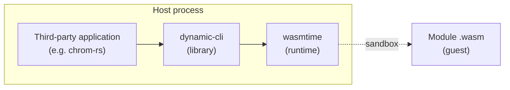
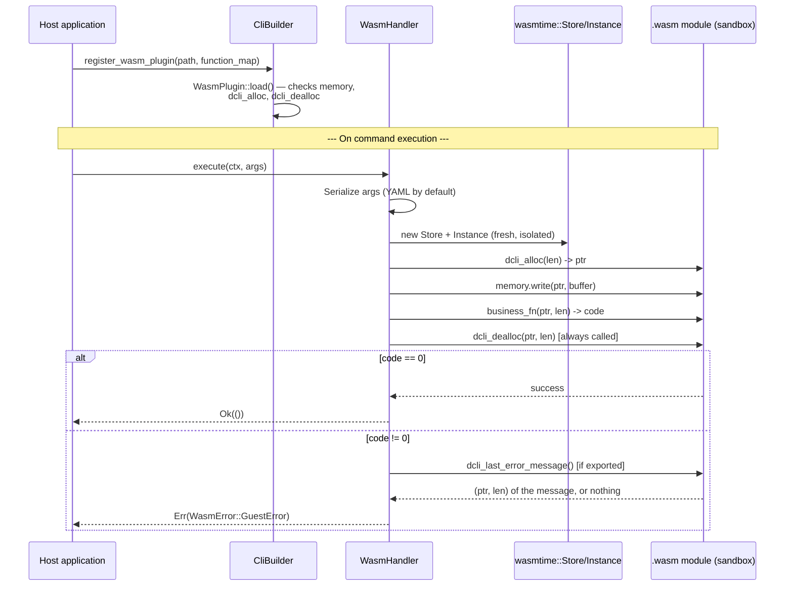

# Plugin Design Guide — `dynamic-cli`

> Getting started with building and registering plugins for a third-party
> application using the `dynamic-cli` crate.

* Decision context:
  * Design decision (plugin system architecture) [DD-021](https://github.com/biface/dcli/issues/10)
  * Static plugin implementation: [`Plugin` trait](https://github.com/biface/dcli/issues/22)
  * Sandboxed WASM plugin implementation: [`WasmPlugin`](https://github.com/biface/dcli/issues/23)
* **Last updated**: 2026-06-17 (v0.4.0)

---

## Overview

`dynamic-cli` offers two ways to extend an application with handlers that do not live in the host application's own crate:

| Mechanism | When to use it | Cost |
|---|---|---|
| **Static plugins** (`Plugin` trait) | The plugin's code is compiled into the host binary | No `unsafe`, no extra dependency, no runtime overhead |
| **WASM plugins** (`WasmPlugin`) | The plugin must be distributed and loaded independently of the host binary, or run in a sandbox | `wasmtime` dependency (opt-in via `features = ["wasm-plugins"]`), guest-side ABI contract to implement |

A third option was considered and **permanently excluded**: dynamically loading native libraries via `libloading`. Rust's ABI is not stable across compiler versions, which makes this approach structurally unsafe regardless of implementation quality.

Both supported mechanisms share the same architectural principle, inherited from the framework's "config-first" design: **the YAML configuration remains the sole source of truth for command definitions.**

In other words, a plugin — static or WASM — never declares its own commands. It only supplies the *handler* for a command the host application has already declared in its YAML configuration.

---

## The common YAML contract

Whether a handler comes from a static plugin, a WASM plugin, or a direct call to `CliBuilder::register_handler()`, each follows the same registration formalism in the YAML configuration file.

A command entry names an `implementation`, and *something* must supply a handler under that exact name by the time `CliBuilder::build()` runs. For more on the YAML configuration, see [The configuration syntax](CONFIG_SYNTAX_REFERENCE.md).

```yaml
commands:
  - name: greet
    description: "Greet someone"
    implementation: greet_hello   # <- this is the key a plugin must match
    arguments: []
    options: []
```

`build()` does not care where `greet_hello` comes from. Whether it comes from a static plugin's `Plugin::handlers()`, a WASM plugin's mapped business function, or a directly registered `Box<dyn CommandHandler>`, all are merged into the same internal resolution table before commands are resolved.

This also makes it possible to combine multiple mechanisms within the same application: a `SystemPlugin` for `help`/`version`/`exit`, a WASM plugin for a sandboxed third-party command, and a hand-written native handler for the application's core business logic can all coexist — as long as none of these mechanisms claims the same `implementation` name.

If two sources attempt to supply the same `implementation` name, `build()` fails with an explicit conflict error rather than letting one silently overwrite the other. See [Conflict detection](#conflict-detection) below.

---

## Static plugins

### The `Plugin` trait

```rust
pub trait Plugin: Send + Sync {
    fn name(&self) -> &str;
    fn version(&self) -> &str;
    fn description(&self) -> &str;
    fn handlers(&self) -> Vec<(String, Box<dyn CommandHandler>)>;
}
```

A plugin declares metadata — `name`, `version`, `description`, used for introspection, for example listing loaded plugins — and the handlers it supplies, each tagged with the `implementation` name it must match.

The trait is deliberately *declarative*: a plugin returns its handlers; it does not receive a `&mut CommandRegistry` to register them itself.

This keeps registration control on the framework's side, not the plugin's. It is exactly the same pattern `CommandHandler` itself follows: a handler declares its execution logic, the framework decides when to invoke it.

This also lets the framework validate every handler name before any of them touches the registry — which is what makes clean conflict detection possible (see below) instead of letting a plugin silently overwrite an existing command.

### Registering a static plugin

```rust
use dynamic_cli::CliBuilder;
use dynamic_cli::plugin::SystemPlugin;

let app = CliBuilder::new()
    .config_file("commands.yaml")
    .context(Box::new(MyContext::default()))
    .register_plugin(Box::new(SystemPlugin::new()))
    .build()?;
```

`register_plugin()` can be called multiple times, and freely combined with `register_handler()` for handlers that do not come from a plugin.

### `SystemPlugin` — the reference implementation

`dynamic-cli` ships a ready-to-use static plugin: [`SystemPlugin`](../src/plugin/system.rs), which supplies the three commands almost every application needs:

| `implementation` name | Behaviour |
|---|---|
| `system_help` | Prints application or per-command help via the active `HelpFormatter` |
| `system_version` | Prints the version from the config's `metadata.version` |
| `system_exit` | Runs a shutdown callback, then exits |

```yaml
commands:
  - name: help
    implementation: system_help
    aliases: ["h", "?"]
    description: "Show help"
    arguments: []
    options: []

  - name: version
    implementation: system_version
    description: "Show version"
    arguments: []
    options: []

  - name: exit
    implementation: system_exit
    aliases: ["quit", "q"]
    description: "Exit the application"
    arguments: []
    options: []
```

```rust
CliBuilder::new()
    .config_file("commands.yaml")
    .context(Box::new(MyContext::default()))
    .register_plugin(Box::new(SystemPlugin::new()))
    .build()?
    .run()
```

#### Shutdown callback

The default behaviour of `system_exit` is `std::process::exit(0)`. An application that needs a clean shutdown sequence — flushing logs, closing connections, persisting state — can supply its own callback:

```rust
SystemPlugin::new()
    .with_exit_fn(|| {
        eprintln!("Saving session…");
        // close resources here
        std::process::exit(0);
    })
```

The callback runs before the process terminates; it is the application's responsibility to actually exit at the end of it.

### Writing your own static plugin

A static plugin is any type that implements `Plugin`. No scaffolding or macro is required — see the rustdoc of `src/plugin/mod.rs` for a complete minimal example, and `src/plugin/system.rs` for a plugin with multiple handlers and constructor-supplied configuration (`with_config`, `with_exit_fn`).

#### Concrete example — a diagnostics plugin for `chrom-rs`

`chrom-rs` is a liquid chromatography simulation application. Its scenarios are driven by three independent YAML files (`model.yml`, `scenario.yml`, `solver.yml`) consumed by the `chrom-rs run` command.

Before running a potentially long simulation — RK4 over several thousand time points — it is useful to be able to validate the consistency of the three files without running the solver.

The example below follows `chrom-rs`'s actual structure: its `ExecutionContext` (`ChromContext`, which carries a validated `project_dir`), the downcast pattern used by `RunHandler`, and the option schema as defined in `commands.yml`.

The plugin lives in its own file, next to `app.rs`, as a new submodule of `src/cli/`:

```
src/cli/
    mod.rs           — build_app(), orchestration (existing)
    app.rs           — ChromContext, RunHandler (existing)
    diagnostics.rs   — DiagnosticsPlugin, ValidateConfigHandler (new)
```

`src/cli/diagnostics.rs`:

```rust
use dynamic_cli::plugin::Plugin;
use dynamic_cli::executor::CommandHandler;
use dynamic_cli::context::ExecutionContext;
use dynamic_cli::error::ExecutionError;
use dynamic_cli::DynamicCliError;
use std::collections::HashMap;

use crate::cli::app::ChromContext;

/// Diagnostics plugin for chrom-rs: checks that the configuration files
/// are present before a costly run.
struct DiagnosticsPlugin;

impl Plugin for DiagnosticsPlugin {
    fn name(&self) -> &str { "chrom-diagnostics" }
    fn version(&self) -> &str { "1.0.0" }
    fn description(&self) -> &str {
        "Validates model/scenario/solver files before simulation"
    }

    fn handlers(&self) -> Vec<(String, Box<dyn CommandHandler>)> {
        vec![
            ("validate_config".to_string(), Box::new(ValidateConfigHandler)),
        ]
    }
}

struct ValidateConfigHandler;

impl CommandHandler for ValidateConfigHandler {
    fn execute(
        &self,
        ctx: &mut dyn ExecutionContext,
        args: &HashMap<String, String>,
    ) -> dynamic_cli::Result<()> {
        // Same downcast pattern as RunHandler (src/cli/app.rs): the
        // plugin needs the project_dir already validated by ChromContext,
        // not a raw path.
        let chrom_ctx = ctx
            .as_any_mut()
            .downcast_mut::<ChromContext>()
            .ok_or_else(|| {
                DynamicCliError::from(ExecutionError::ContextDowncastFailed {
                    expected_type: "ChromContext".to_string(),
                    suggestion: None,
                })
            })?;

        let project_dir = chrom_ctx.project_dir();

        // The default values ("model.yml", "scenario.yml", "solver.yml")
        // are now carried by `default:` in commands.yml and already
        // applied by the parser before this handler runs
        // (`CliParser::apply_defaults`) — args.get() should therefore
        // never return None here as long as the YAML stays consistent
        // with the declared command. The fallback below remains
        // defensive, not strictly necessary in normal use.
        let model = args.get("model").map(String::as_str).unwrap_or("model.yml");
        let scenario = args.get("scenario").map(String::as_str).unwrap_or("scenario.yml");
        let solver = args.get("solver").map(String::as_str).unwrap_or("solver.yml");

        for (label, file) in [("model", model), ("scenario", scenario), ("solver", solver)] {
            let path = project_dir.join(file);
            if !path.is_file() {
                println!("✗ {label}: file not found ({})", path.display());
            } else {
                println!("✓ {label}: {}", path.display());
            }
        }

        // A real implementation would push validation further: chemical
        // species consistency between model.yml and scenario.yml, domain
        // bounds compatible with the solver configuration.
        Ok(())
    }
}
```

Here is the complete `commands.yml` for `chrom-rs`, with the plugin's `validate-config` command integrated next to the existing `run` command (every field — `short`, `long`, `option_type`, `default`, `choices` — is required by the schema; see [`CONFIG_SYNTAX_REFERENCE.md`](CONFIG_SYNTAX_REFERENCE.md)):

```yaml
metadata:
  version: "0.2.0"
  prompt: "chrom-rs"
  prompt_suffix: " > "

commands:
  - name: run
    aliases:
      - simulate
    description: "Run a chromatography simulation from three configuration files."
    required: true
    arguments: []
    options:
      - name: project-dir
        short: "d"
        long: project-dir
        option_type: path
        required: false
        default: "."
        description: "Root directory for all file names (no '..' allowed)."
        choices: []

      - name: model
        short: "m"
        long: model
        option_type: string
        required: true
        default: ~
        description: "Model configuration file (e.g. model.yml)."
        choices: []

      - name: scenario
        short: "s"
        long: scenario
        option_type: string
        required: true
        default: ~
        description: "Scenario configuration file (e.g. scenario.yml)."
        choices: []

      - name: solver
        short: "S"
        long: solver
        option_type: string
        required: true
        default: ~
        description: "Solver configuration file (e.g. solver.yml)."
        choices: []

      - name: output-csv
        short: ~
        long: output-csv
        option_type: path
        required: false
        default: ~
        description: "Write simulation results to a CSV file."
        choices: []

      - name: output-plot
        short: ~
        long: output-plot
        option_type: path
        required: false
        default: ~
        description: "Save chromatogram plot to a PNG or SVG file."
        choices: []

      - name: export-json
        short: ~
        long: export-json
        option_type: path
        required: false
        default: ~
        description: "Export full simulation result to a JSON file."
        choices: []

    implementation: run_handler

  # ──────────────────────────────────────────────────────────────────────
  # New command — supplied by DiagnosticsPlugin (src/cli/diagnostics.rs)
  # See PLUGIN_GUIDE.md, "Static plugins" section.
  # ──────────────────────────────────────────────────────────────────────
  - name: validate-config
    aliases:
      - check
    description: "Validates that model/scenario/solver files are present before simulation."
    required: false
    arguments: []
    options:
      - name: project-dir
        short: "d"
        long: project-dir
        option_type: path
        required: false
        default: "."
        description: "Root directory for all file names (no '..' allowed)."
        choices: []

      - name: model
        short: "m"
        long: model
        option_type: string
        required: false
        default: "model.yml"
        description: "Model configuration file (e.g. model.yml)."
        choices: []

      - name: scenario
        short: "s"
        long: scenario
        option_type: string
        required: false
        default: "scenario.yml"
        description: "Scenario configuration file (e.g. scenario.yml)."
        choices: []

      - name: solver
        short: "S"
        long: solver
        option_type: string
        required: false
        default: "solver.yml"
        description: "Solver configuration file (e.g. solver.yml)."
        choices: []

    implementation: validate_config

global_options: []
```

The `run` block is unchanged from the original file — only the `validate-config` block is new, added by the plugin. The `project-dir`/`model`/`scenario`/`solver` options deliberately reuse the same shorts (`-d`/`-m`/`-s`/`-S`) as `run`: each command has its own namespace for its short options, so no collision is possible between two different commands.

And the registration, in `chrom-rs`'s `src/cli/mod.rs`, next to `RunHandler`. Two additions compared to the existing file: the new submodule declaration, and the `register_plugin` call in `build_app`:

```rust
// New, next to `pub mod app;`
pub mod diagnostics;

use app::{ChromContext, RunHandler};
use diagnostics::DiagnosticsPlugin;

pub fn build_app() -> anyhow::Result<CliApp> {
    let config =
        load_yaml(COMMANDS_YML).map_err(|e| anyhow!("embedded commands.yml is invalid: {e}"))?;

    CliBuilder::new()
        .config(config)
        .context(Box::new(ChromContext::new()))
        .register_handler(RUN_HANDLER_NAME, Box::new(RunHandler))
        .register_plugin(Box::new(DiagnosticsPlugin))
        .build()
        .map_err(|e| anyhow!("CLI builder error: {e}"))
}
```

This plugin coexists with `chrom-rs`'s own `run` command — a native handler, not a plugin — without any interference. This is exactly the coexistence scenario described in [the common YAML contract](#the-common-yaml-contract) above: `run_handler` (native) and `validate_config` (plugin) are merged into the same table by `build()`.

---

## WASM plugins

### The concept

#### Who is the host, who is the guest

Three distinct actors are involved, and it is important not to confuse them.

`dynamic-cli` is a library. It never runs on its own — it is compiled inside the binary of a third-party application, such as `chrom-rs`.

It is this **third-party application, with `dynamic-cli` compiled into it**, that constitutes the **host**. The host is therefore the process that actually runs on the end user's machine — `dynamic-cli` is only part of that process's code, not the process itself.

The **guest** is the `.wasm` module loaded by that host. It runs inside a sandbox provided by `wasmtime`, itself called from `dynamic-cli`'s code.



When this guide uses "the host" in the WASM context, it therefore refers to `dynamic-cli`'s code acting on behalf of the application that uses it — not the application itself in the sense of its business logic, and certainly not the guest.

#### Why a sandbox

A WASM plugin is a binary module (`.wasm`) compiled separately from `dynamic-cli` and from the host application.

Unlike a static plugin — which shares the host process's memory space — a WASM plugin runs in its own isolated linear memory space.

The host cannot directly read from or write to the guest's memory. The guest cannot access the host's memory either. All data exchange goes through an explicit protocol — allocated on the guest side, written by the host, read by the guest — rather than through direct sharing of Rust structures.

This isolation has a cost: serializing arguments, allocating and freeing memory on every call.

It also has a payoff: the plugin can be written in any language capable of targeting WASM, distributed as a simple binary file independently of the host application's binary, and loaded without recompiling the latter.

### How it is implemented in `dynamic-cli`



Three structural points stand out from this diagram.

**Loading and execution are two distinct phases.** `WasmPlugin::load` validates the mandatory exports once, at load time — not on every command call.

**Each call gets its own `Store`/`Instance`.** No state persists between two invocations of the same command. This is deliberate: it guarantees isolation and avoids state leaks between calls.

**`dcli_dealloc` is called on every exit path**, including when the guest errors out. This is what guarantees that a long-running REPL session does not accumulate unfreed guest memory.

### Enabling the mechanism

WASM plugins trade the compile-time coupling of static plugins for a sandboxed execution at runtime.

A `.wasm` module can be distributed independently of the host application and loaded at runtime, with no `unsafe` code on the host side.

They require the `wasm-plugins` feature flag:

```toml
[dependencies]
dynamic-cli = { version = "0.4.0", features = ["wasm-plugins"] }
```

### Registering a WASM plugin

```rust
use dynamic_cli::CliBuilder;
use std::path::Path;

let app = CliBuilder::new()
    .config_file("commands.yaml")
    .context(Box::new(MyContext::default()))
    .register_wasm_plugin(
        Path::new("plugins/greet.wasm"),
        &[("greet_hello", "say_hello")],
    )?
    .build()?;
```

### The role of `function_map`

`function_map` (the second argument of `register_wasm_plugin`) establishes the correspondence between two worlds that have no reason to share the same vocabulary:

- **On the host application's YAML config side** — the `implementation` field of a command, exactly as for a static plugin or a native handler.
- **On the `.wasm` module side** — the name actually exported by the WASM binary, chosen freely by the plugin author, who has probably never seen the YAML config of the application that will use it.

Each `function_map` entry is therefore a pair `(implementation_name, wasm_exported_function_name)`:

```rust
&[("greet_hello", "say_hello")]
//   ↑                ↑
//   │                └─ name exported by the .wasm module (chosen by the plugin author)
//   └─ value of the `implementation` field in the host's YAML config
```

These two names are **under no obligation to be identical** — `greet_hello` and `say_hello` could just as well both be `greet`, or be entirely different, without changing the behaviour. This decoupling is intentional: it lets the plugin author name their exported functions according to their own conventions, without needing to know in advance the `implementation` name each host application will choose.

**Why this parameter is mandatory, with no default.** An empty table would register zero handlers — the plugin would load successfully (the mandatory exports are valid), but would remain silently inert: no command could ever reach it. This is exactly the kind of defect best caught at compile time / while writing the code, rather than discovered at runtime when a command that is supposed to work does nothing. This is also why `with_format` and `with_metadata`, which have reasonable defaults (YAML, file-name-derived metadata), remain optional — the difference in treatment is not arbitrary; it reflects the presence or absence of a safe default behaviour.

Applications needing a non-default serialization format or explicit metadata should build a `WasmPlugin` directly and pass it to `register_plugin()`:

```rust
use dynamic_cli::plugin::wasm::{WasmPlugin, WasmSerializationFormat};

let plugin = WasmPlugin::load(Path::new("plugins/greet.wasm"))?
    .with_function_map("greet_hello", "say_hello")
    .with_format(WasmSerializationFormat::Json)
    .with_metadata("greet", "1.0.0", "Greeting commands");

CliBuilder::new()
    .config_file("commands.yaml")
    .context(Box::new(MyContext::default()))
    .register_plugin(Box::new(plugin))
    .build()?;
```

### The YAML side

In principle identical to a static plugin — the config declares a command with an `implementation` name; that name must appear as the first element of a `function_map` entry, **not** the name of the function exported by the WASM module (the second element):

```yaml
commands:
  - name: greet
    implementation: greet_hello   # <- matches function_map's first element
    description: "Greet someone"
    arguments: []
    options: []
```

```rust
.register_wasm_plugin(
    Path::new("plugins/greet.wasm"),
    &[("greet_hello", "say_hello")],
    //  ^ implementation       ^ name exported by the .wasm module
)?
```

### The guest-side ABI contract

This is the part a *plugin author* (the person writing the `.wasm` module, who may have no knowledge of `dynamic-cli`'s Rust internals) needs to implement.

#### Mandatory exports

| Export name | Signature | Purpose |
|---|---|---|
| `memory` | linear memory | Shared buffer for argument and result transfer |
| `dcli_alloc` | `(size: i32) -> i32` | Host asks the guest to reserve `size` bytes; returns the pointer |
| `dcli_dealloc` | `(ptr: i32, size: i32)` | Host asks the guest to free a buffer it had previously allocated |
| *(business function)* | `(ptr: i32, len: i32) -> i32` | Reads serialized arguments at `ptr`/`len`; returns `0` on success, a non-zero value on error |

The business function's exported name is chosen freely by the plugin author — `dynamic-cli` imposes no naming convention on it, beyond the three reserved names above and the optional export below.

A module may export more than one business function; each one mapped to a distinct `implementation` name in `function_map` becomes a separate command handler.

**Why `dcli_alloc` and `dcli_dealloc` are both mandatory.**

The host cannot safely write into a guest's linear memory at an arbitrary offset — only the guest knows which regions are free. `dcli_alloc` lets the host ask the guest to reserve space before writing the serialized arguments into it.

`dcli_dealloc` is mandatory, not optional, by deliberate choice. A plugin that allocates without ever freeing leaks guest memory on every invocation.

`dynamic-cli` calls `dcli_dealloc` on **every** exit path of a handler call — including when the business function itself returns a non-zero error code. This is what guarantees that a long-running REPL session, repeatedly invoking the same plugin command, never accumulates unfreed buffers.

#### Optional export

| Export name | Signature | Purpose |
|---|---|---|
| `dcli_last_error_message` | `() -> (ptr: i32, len: i32)` | Returns a detailed error message when the business function returns a non-zero code |

When a business function returns a non-zero code, the host attempts to call `dcli_last_error_message` to obtain a human-readable explanation.

The returned `len` value is read literally. If it does not exactly match the number of meaningful bytes at `ptr`, surrounding memory — typically zero-initialized padding — will be included in the message.

If this export is absent, or if calling it fails for any reason, the error surfaces with only the raw code (`message: None`). A missing or unreadable message degrades gracefully: it never causes the command to fail differently, and never escalates into a separate error.

No other optional export exists in this version.

#### Argument serialization

Handler arguments — the `HashMap<String, String>` a native `CommandHandler` would receive — are serialized into a byte buffer before crossing the host/guest boundary.

**YAML is the default format**, consistent with the framework's config-first principle. A plugin author who prefers JSON can request it on the host side via `WasmPlugin::with_format(WasmSerializationFormat::Json)` — this is a host-side setting; the guest simply needs to be written to parse whichever format the host is configured to send.

The guest receives the serialized buffer exactly as written by the host: no length prefix, no envelope — just the raw YAML or JSON bytes at `ptr`, `len` bytes long.

#### Call sequence

For a single command invocation, the host performs the following sequence on a freshly created `Store` and `Instance` — each call gets its own isolated instantiation; no state persists between invocations of the same plugin:

1. Serialize the handler's arguments (YAML by default).
2. Call `dcli_alloc(len)` to obtain a pointer `ptr` into guest memory.
3. Write the serialized bytes into guest memory at `ptr`.
4. Call the mapped business function as `(ptr, len) -> i32`.
5. Call `dcli_dealloc(ptr, len)` — unconditionally, regardless of step 4's
   outcome.
6. If the business function returned `0`: the command succeeds.
7. If it returned a non-zero value: attempt `dcli_last_error_message()`
   for a detailed message (best-effort, see above), then surface the
   error to the host application.

#### Minimal, reproducible example (WAT)

The following example is deliberately written in WAT (WebAssembly Text format) rather than in Rust: `wasmtime::Module::new` accepts WAT directly, with no external compilation toolchain required. This is exactly the same approach used to validate `dynamic-cli`'s integration test suite (`tests/integration/wasm_plugin_test.rs`) — this module is therefore guaranteed compatible with the expected ABI contract, since it follows the structure proven by the tests.

```wat
(module
    (memory (export "memory") 1)

    ;; Trivial allocator: a fixed pointer at offset 1024.
    ;; Sufficient for a single-call example; a real plugin would manage
    ;; an actual heap if concurrent allocations are possible.
    (func (export "dcli_alloc") (param i32) (result i32)
        i32.const 1024)

    ;; No-op dealloc: nothing to free with a fixed-pointer allocator.
    (func (export "dcli_dealloc") (param i32 i32))

    ;; Business function mapped to the "greet_hello" implementation on
    ;; the host side. Deliberately ignores the received content to stay
    ;; minimal — a real plugin would read and deserialize the bytes at
    ;; ptr/len.
    (func (export "say_hello") (param i32 i32) (result i32)
        i32.const 0)
)
```

To load it from a file in a real application, write this content into `greet.wasm` (the `.wasm` extension does not enforce the binary format — `wasmtime` detects and accepts plain-text WAT):

```rust
CliBuilder::new()
    .config_file("commands.yaml")
    .context(Box::new(MyContext::default()))
    .register_wasm_plugin(Path::new("greet.wasm"), &[("greet_hello", "say_hello")])?
    .build()?;
```

#### Rust example (`wasm32-unknown-unknown`) — verify on your toolchain

The following example illustrates the same logic in Rust, with an actual read of the serialized arguments. Other languages capable of targeting WASM and exporting C ABI-compatible functions (C, AssemblyScript, Zig, …) are equally valid — `dynamic-cli` imposes no Rust-specific requirement on the guest side.

**Warning**: this code has not been compiled or run as part of writing this guide — it illustrates the standard approach (allocator via `Box::into_raw`/`Box::from_raw`, reading via `std::slice::from_raw_parts`) but must be verified by an actual build before being used in production.

```rust
// Plugin's Cargo.toml:
//   [lib]
//   crate-type = ["cdylib"]
//   [dependencies]
//   serde = { version = "1.0", features = ["derive"] }
//   serde_yaml = "0.9"

#[no_mangle]
pub extern "C" fn dcli_alloc(size: i32) -> i32 {
    let buf = vec![0u8; size as usize].into_boxed_slice();
    Box::into_raw(buf) as *mut u8 as i32
}

#[no_mangle]
pub extern "C" fn dcli_dealloc(ptr: i32, size: i32) {
    unsafe {
        let slice = std::slice::from_raw_parts_mut(ptr as *mut u8, size as usize);
        drop(Box::from_raw(slice as *mut [u8]));
    }
}

#[no_mangle]
pub extern "C" fn say_hello(ptr: i32, len: i32) -> i32 {
    let bytes = unsafe { std::slice::from_raw_parts(ptr as *const u8, len as usize) };
    let args: std::collections::HashMap<String, String> = match serde_yaml::from_slice(bytes) {
        Ok(a) => a,
        Err(_) => return 1,
    };
    let name = args.get("name").cloned().unwrap_or_else(|| "World".to_string());
    println!("Hello, {name}!");
    0
}
```

Compiling to `wasm32-unknown-unknown`:

```bash
rustup target add wasm32-unknown-unknown
cargo build --release --target wasm32-unknown-unknown
# The resulting binary is found at:
#   target/wasm32-unknown-unknown/release/<crate_name>.wasm
```

Before shipping the plugin, verify that the expected exports are actually present in the compiled binary — for example with `wasm-objdump -x` (from the `wabt` package) or any equivalent WASM introspection tool: `memory`, `dcli_alloc`, `dcli_dealloc`, and the chosen business function must all appear in the export list.

**A note on `dcli_last_error_message`.** `dynamic-cli` calls this export as a genuine multi-value WASM function, returning two `i32` results — equivalent to this WAT signature:

```wat
(func (export "dcli_last_error_message") (result i32 i32)
    ;; push ptr, then len, in that order
    ...)
```

Plain `extern "C"` functions in Rust compiled to `wasm32-unknown-unknown` cannot portably express a genuine two-`i32` multi-value WASM return across all toolchain versions — encoding schemes that pack both values into a single `i64` are **not** compatible with this contract; `dynamic-cli` calls the export expecting exactly two separate `i32` results, not one packed value. Verify your toolchain's actual generated code (for example by inspecting the compiled `.wasm` with `wasm-objdump` or `wasmtime`'s own introspection tools) before shipping a plugin that relies on this optional export. If your toolchain cannot express it reliably, omit the export — the error will simply surface with `message: None`, the documented, safe fallback.

---

## Conflict detection

`CliBuilder::build()` merges the handlers of every static plugin, the mapped handlers of every WASM plugin, and every directly-registered handler into a single internal table, indexed by `implementation` name.

If two sources claim the same name, `build()` returns an error identifying the offending plugin and name, with a suggestion to either rename the conflicting `implementation` in the YAML config, or remove the duplicate registration call.

This applies uniformly regardless of which mechanism is used on each side. A static plugin colliding with a WASM plugin's mapped name is detected exactly like two static plugins colliding with each other.

---

## Restrictions and limitations (WASM plugins)

This section distinguishes two categories of a different nature.

A **restriction** is a deliberate structural choice, motivated by the security of the sandbox model. It will not change — lifting it would mean abandoning the isolation guarantee WASM plugins are meant to provide.

A **limitation** is a missing feature in the current version, with no fundamental obstacle to adding it later. It might evolve someday, or might never be addressed if no concrete need arises — no commitment is made either way.

### Restriction — no access to `ExecutionContext`

WASM handlers do **not** receive the host application's `ExecutionContext`.

This is a deliberate boundary, not an oversight. Trait objects cannot cross the WASM FFI boundary. Exposing arbitrary host state to a sandboxed guest would also defeat the very purpose of the sandbox.

WASM plugins in this version therefore exchange only serialized arguments and a result code accompanied by an optional message — nothing else.

Concretely: a WASM plugin cannot read or write the host application's in-memory state. It cannot access whatever the host's `ExecutionContext` wraps — a database connection, a session object, etc. It has no way to call back into host-defined behaviour.

This restriction will not be lifted in a future version without calling the sandbox model itself into question.

### Limitation — no host functions, no WASI

This version exposes no host-defined function to the guest: no `host_log`, no `host_get_state`, nothing imported by the module beyond what WASM itself provides. It also does not wire up WASI.

A WASM plugin is, in practice, a pure function from serialized arguments to a result code and an optional message. It cannot perform any I/O, any logging, or any interaction with the outside world through `dynamic-cli` itself.

Unlike the previous restriction, this is not a security principle — it is simply something that has not been built yet. See the directions below.

### Possible future directions for the limitations

These are not commitments, and none is planned for the current cycle.

**Restricted host functions** — exposing a small, explicit set of host-defined functions (for example `host_log`, `host_get_state`/`host_set_state`) that a guest could import. This would give controlled access to host capabilities without breaking the sandbox model.

**Capability declarations** — a plugin declaring upfront which capabilities it needs (file access, network, shared state), with the host exposing only the corresponding host functions. This would preserve the sandbox model's security properties even as capabilities expand.

**WASI integration** — via `wasmtime-wasi`, for plugins that genuinely need standardized, auditable access to the filesystem or the network.

Each of these directions would constitute a new, explicitly versioned decision — not a silent extension of the current contract.

---

## Related references

- Issue [#10](https://github.com/biface/dcli/issues/10) — the architectural
  decision behind static (Option A) and WASM (Option C) plugins, and the
  permanent exclusion of dynamic loading via `libloading` (Option B).
- `src/plugin/mod.rs` (rustdoc) — the `Plugin` trait, full API reference.
- `src/plugin/system.rs` (rustdoc) — `SystemPlugin`, a complete reference
  implementation.
- `src/plugin/wasm.rs` (rustdoc) — `WasmPlugin`, `WasmSerializationFormat`,
  the Rust-side WASM loader API.
- [`CONFIG_SYNTAX_REFERENCE.md`](CONFIG_SYNTAX_REFERENCE.md) — full YAML
  command configuration syntax.
